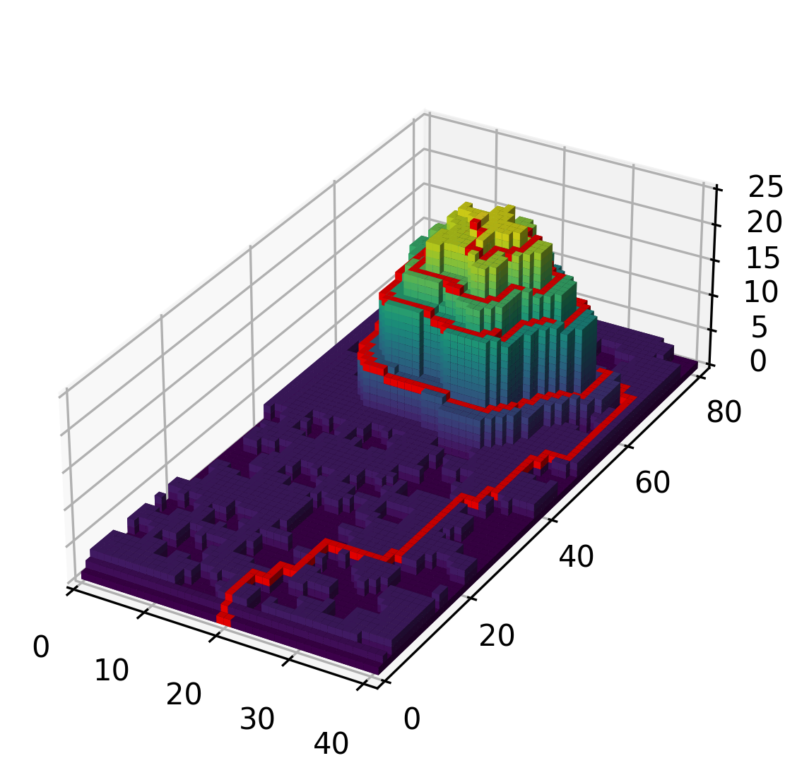
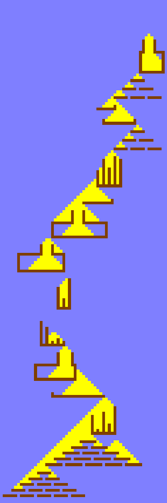
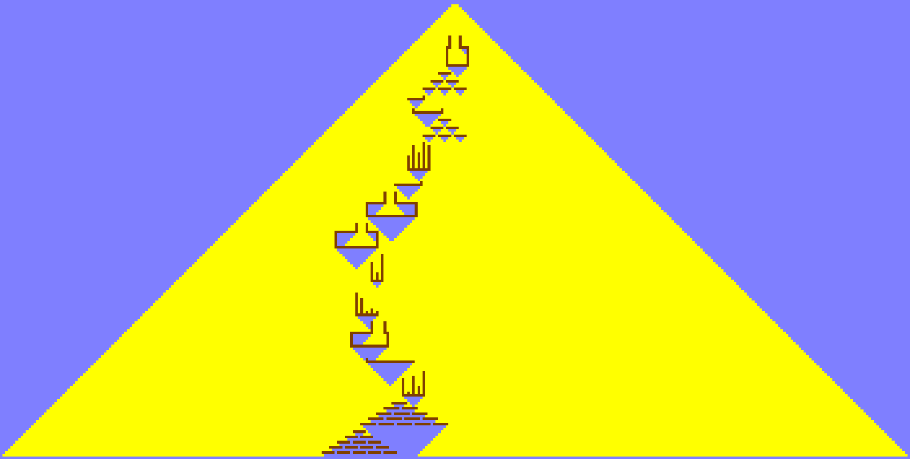

# Advent of Code 2022
This repository contains my Python solutions for the [Advent of Code 2022](https://adventofcode.com/2022) challenges.

The parent directory contains my first attempt at solving the problems (with no external help), while the `revised` directory contains my revisions solutions after reviewing other people's solutions. This directory also contains visualisations for some of the problems.

### Visualisations
 Day 12 3D Voxel Plot 
 Day 14 Part 1
 Day 14 Part 2 
 Day 18
 Day 22

